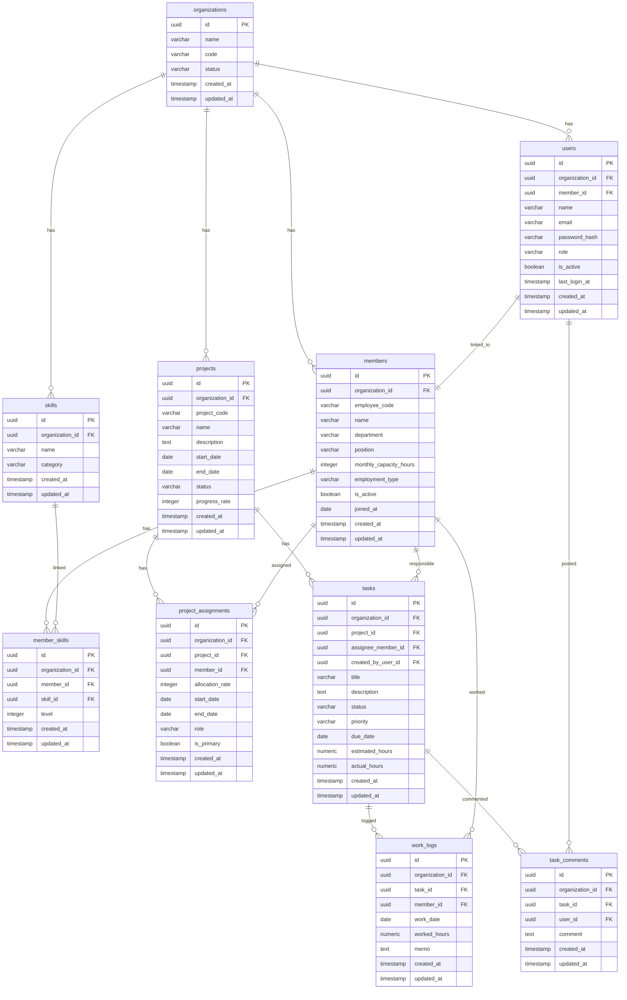

# ER図（DB設計）
## エンジニア向けリソース・プロジェクト管理SaaS

---

# 1. 概要

本システムは、以下を統合管理することを目的とする。

- 組織
- ユーザー
- メンバー
- プロジェクト
- アサイン
- タスク
- 工数
- コメント

ER設計は、将来的なマルチテナント化を前提とし、`organization_id` を主要業務テーブルに持たせる構成とする。

---

# 2. ER全体像

---

# 3. テーブル定義

## 3.1 organizations

|列名|型|PK|NN|説明|
|---|---|---|---|---|
|id|UUID|○|○|組織ID|
|name|VARCHAR(255)||○|組織名|
|code|VARCHAR(100)||○|組織コード|
|status|VARCHAR(50)||○|利用状態|
|created_at|TIMESTAMP|||作成日時|
|updated_at|TIMESTAMP|||更新日時|

### 備考
- 将来的なSaaS化を見据えたテナント単位
- `code` はログイン後の組織識別やURL設計に利用可能

---

## 3.2 users

|列名|型|PK|NN|説明|
|---|---|---|---|---|
|id|UUID|○|○|ユーザーID|
|organization_id|UUID||○|組織ID|
|member_id|UUID|||メンバーID|
|name|VARCHAR(255)||○|表示名|
|email|VARCHAR(255)||○|ログインメール|
|password_hash|VARCHAR(255)||○|ハッシュ済みパスワード|
|role|VARCHAR(50)||○|権限種別|
|is_active|BOOLEAN||○|有効フラグ|
|last_login_at|TIMESTAMP|||最終ログイン日時|
|created_at|TIMESTAMP|||作成日時|
|updated_at|TIMESTAMP|||更新日時|

### 備考
- `role` 例: `admin`, `manager`, `member`
- `member_id` により業務メンバーとログインユーザーを関連付ける

---

## 3.3 members

|列名|型|PK|NN|説明|
|---|---|---|---|---|
|id|UUID|○|○|メンバーID|
|organization_id|UUID||○|組織ID|
|employee_code|VARCHAR(100)|||社員番号|
|name|VARCHAR(255)||○|氏名|
|department|VARCHAR(255)|||部署|
|position|VARCHAR(255)|||役職|
|monthly_capacity_hours|INTEGER|||月次稼働上限時間|
|employment_type|VARCHAR(50)|||雇用区分|
|is_active|BOOLEAN||○|有効フラグ|
|joined_at|DATE|||入社日|
|created_at|TIMESTAMP|||作成日時|
|updated_at|TIMESTAMP|||更新日時|

### 備考
- ログインアカウントを持たないメンバーも登録可能
- 将来的に外部委託や業務委託も管理しやすい

---

## 3.4 skills

|列名|型|PK|NN|説明|
|---|---|---|---|---|
|id|UUID|○|○|スキルID|
|organization_id|UUID||○|組織ID|
|name|VARCHAR(255)||○|スキル名|
|category|VARCHAR(100)|||カテゴリ|
|created_at|TIMESTAMP|||作成日時|
|updated_at|TIMESTAMP|||更新日時|

---

## 3.5 member_skills

|列名|型|PK|NN|説明|
|---|---|---|---|---|
|id|UUID|○|○|メンバースキルID|
|organization_id|UUID||○|組織ID|
|member_id|UUID||○|メンバーID|
|skill_id|UUID||○|スキルID|
|level|INTEGER|||熟練度|
|created_at|TIMESTAMP|||作成日時|
|updated_at|TIMESTAMP|||更新日時|

### 制約
- `(organization_id, member_id, skill_id)` は一意制約

---

## 3.6 projects

|列名|型|PK|NN|説明|
|---|---|---|---|---|
|id|UUID|○|○|プロジェクトID|
|organization_id|UUID||○|組織ID|
|project_code|VARCHAR(100)|||案件コード|
|name|VARCHAR(255)||○|案件名|
|description|TEXT|||説明|
|start_date|DATE|||開始日|
|end_date|DATE|||終了日|
|status|VARCHAR(50)||○|状態|
|progress_rate|INTEGER|||進捗率（0〜100）|
|created_at|TIMESTAMP|||作成日時|
|updated_at|TIMESTAMP|||更新日時|

### ステータス例
- planning
- active
- on_hold
- completed
- cancelled

---

## 3.7 project_assignments

|列名|型|PK|NN|説明|
|---|---|---|---|---|
|id|UUID|○|○|アサインID|
|organization_id|UUID||○|組織ID|
|project_id|UUID||○|プロジェクトID|
|member_id|UUID||○|メンバーID|
|allocation_rate|INTEGER||○|配属率（0〜100）|
|start_date|DATE|||開始日|
|end_date|DATE|||終了日|
|role|VARCHAR(100)|||案件内役割|
|is_primary|BOOLEAN||○|主担当フラグ|
|created_at|TIMESTAMP|||作成日時|
|updated_at|TIMESTAMP|||更新日時|

### 業務ルール
- 同一期間中のメンバー総配属率が100%超過した場合は警告対象
- 完全禁止にするかは業務運用次第で選択

---

## 3.8 tasks

|列名|型|PK|NN|説明|
|---|---|---|---|---|
|id|UUID|○|○|タスクID|
|organization_id|UUID||○|組織ID|
|project_id|UUID||○|プロジェクトID|
|assignee_member_id|UUID|||担当メンバーID|
|created_by_user_id|UUID||○|作成者ユーザーID|
|title|VARCHAR(255)||○|件名|
|description|TEXT|||詳細|
|status|VARCHAR(50)||○|状態|
|priority|VARCHAR(50)||○|優先度|
|due_date|DATE|||期限|
|estimated_hours|NUMERIC(6,2)|||見積工数|
|actual_hours|NUMERIC(6,2)|||実績工数|
|created_at|TIMESTAMP|||作成日時|
|updated_at|TIMESTAMP|||更新日時|

### ステータス例
- todo
- in_progress
- review
- done
- cancelled

### 優先度例
- low
- medium
- high
- critical

---

## 3.9 work_logs

|列名|型|PK|NN|説明|
|---|---|---|---|---|
|id|UUID|○|○|工数ログID|
|organization_id|UUID||○|組織ID|
|task_id|UUID||○|タスクID|
|member_id|UUID||○|メンバーID|
|work_date|DATE||○|作業日|
|worked_hours|NUMERIC(5,2)||○|作業時間|
|memo|TEXT|||備考|
|created_at|TIMESTAMP|||作成日時|
|updated_at|TIMESTAMP|||更新日時|

### 備考
- `tasks.actual_hours` は `work_logs` 集計で更新するか、都度算出とする

---

## 3.10 task_comments

|列名|型|PK|NN|説明|
|---|---|---|---|---|
|id|UUID|○|○|コメントID|
|organization_id|UUID||○|組織ID|
|task_id|UUID||○|タスクID|
|user_id|UUID||○|投稿ユーザーID|
|comment|TEXT||○|コメント本文|
|created_at|TIMESTAMP|||作成日時|
|updated_at|TIMESTAMP|||更新日時|

---

# 4. インデックス設計

## 推奨インデックス

### users
- unique(`organization_id`, `email`)

### members
- index(`organization_id`, `name`)
- unique(`organization_id`, `employee_code`) ※運用で社員番号が必須の場合

### projects
- index(`organization_id`, `status`)
- index(`organization_id`, `start_date`, `end_date`)

### project_assignments
- index(`organization_id`, `member_id`)
- index(`organization_id`, `project_id`)
- index(`organization_id`, `start_date`, `end_date`)

### tasks
- index(`organization_id`, `project_id`)
- index(`organization_id`, `assignee_member_id`)
- index(`organization_id`, `status`)
- index(`organization_id`, `due_date`)

### work_logs
- index(`organization_id`, `member_id`, `work_date`)
- index(`organization_id`, `task_id`, `work_date`)

---

# 5. 業務ルール

## 5.1 アサイン率
- メンバーごとの同時期アサイン合計率を可視化する
- MVPでは警告表示、将来的に登録制御も可能

## 5.2 タスク実績工数
- 工数ログ合計から自動反映する
- 手動更新を避け、整合性を担保する

## 5.3 組織分離
- 全業務テーブルに `organization_id` を付与
- APIレイヤで必ず組織スコープを適用

## 5.4 論理削除
- MVPでは物理削除でも可
- 将来的には `deleted_at` 導入を推奨

---

# 6. 初期実装優先順位

## MVP対象
- organizations
- users
- members
- projects
- project_assignments
- tasks
- work_logs
- task_comments

## 将来拡張
- notifications
- audit_logs
- file_attachments
- project_labels
- task_labels
- backlog_integrations
- github_integrations

---

# 7. 補足

本ERは、以下の要件を実現するための基礎設計である。

- 各個人のリソース管理
- プロジェクト単位のアサイン可視化
- タスク進捗と工数の統合管理
- 将来的なSaaS化への拡張性確保
