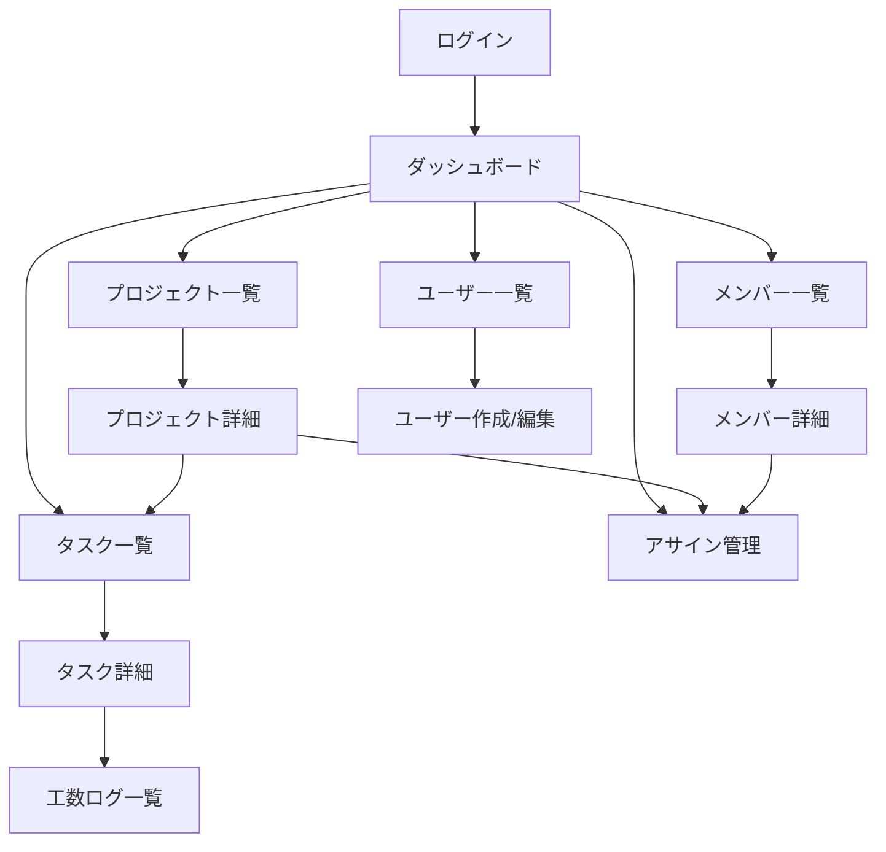

# 画面設計書
## エンジニア向けリソース・プロジェクト管理SaaS

---

# 1. 画面設計方針

本システムは、社内管理ツールとして以下を重視する。

- 一覧性
- 検索性
- 稼働状況の可視化
- プロジェクトとタスクの横断把握
- 管理画面としての操作性

フロントエンドは Next.js + React を採用し、管理画面UIを前提とする。

---

# 2. 画面一覧

|画面ID|画面名|概要|
|---|---|---|
|SCR-001|ログイン画面|認証|
|SCR-010|ダッシュボード|稼働率・進捗・遅延の俯瞰|
|SCR-020|メンバー一覧|メンバー検索・一覧|
|SCR-021|メンバー詳細|メンバー情報・稼働状況|
|SCR-030|プロジェクト一覧|案件検索・一覧|
|SCR-031|プロジェクト詳細|案件情報・アサイン・タスク|
|SCR-040|アサイン管理|案件配属の登録・編集|
|SCR-050|タスク一覧|タスク検索・一覧|
|SCR-051|タスク詳細|タスク詳細・コメント・工数|
|SCR-060|工数ログ一覧|工数の検索・確認|
|SCR-070|ユーザー一覧|ログインユーザー管理|
|SCR-071|ユーザー作成/編集|ユーザー登録・更新|

---

# 3. 画面遷移図



---

# 4. 共通レイアウト

## 4.1 基本構成

- ヘッダー
- サイドメニュー
- パンくず
- メインコンテンツ
- 通知トースト

## 4.2 サイドメニュー案

- ダッシュボード
- メンバー管理
- プロジェクト管理
- アサイン管理
- タスク管理
- 工数管理
- ユーザー管理
- 設定（将来）

---

# 5. 画面詳細

## SCR-001 ログイン画面

### 目的
- ユーザー認証を行う

### 項目
|項目|形式|必須|説明|
|---|---|---|---|
|メールアドレス|input|○|ログインID|
|パスワード|password|○|ログインパスワード|

### ボタン
- ログイン

### バリデーション
- 必須チェック
- メール形式チェック

---

## SCR-010 ダッシュボード

### 目的
- 組織全体の稼働状況を俯瞰する

### 表示ブロック
1. KPIカード
   - 進行中プロジェクト数
   - 未完了タスク数
   - 遅延タスク数
   - 過負荷メンバー数

2. メンバー稼働率一覧
   - 名前
   - 部署
   - 現在配属率
   - タスク数

3. プロジェクト進捗一覧
   - プロジェクト名
   - ステータス
   - 進捗率
   - アサイン人数

4. 遅延タスク一覧
   - タスク名
   - 担当者
   - 期限
   - 優先度

### UIメモ
- 一覧はカード＋テーブル混在
- 配属率はプログレスバー表現が適する

---

## SCR-020 メンバー一覧

### 目的
- メンバーの検索と一覧確認

### 検索条件
|項目|形式|
|---|---|
|キーワード|テキスト|
|部署|セレクト|
|在籍状態|セレクト|

### 一覧項目
|列名|説明|
|---|---|
|氏名|メンバー名|
|部署|所属部署|
|役職|役職|
|月次稼働上限|時間|
|現在配属率|%|
|進行中タスク数|件数|
|状態|有効/無効|

### 操作
- 詳細
- 編集
- 新規登録

---

## SCR-021 メンバー詳細

### 目的
- メンバー単位の稼働・案件・タスク状況確認

### 表示内容
- 基本情報
- スキル一覧
- 現在のアサイン一覧
- 担当タスク一覧
- 配属率サマリ
- 月次工数サマリ

### UIメモ
- 上部に基本情報カード
- 下部をタブ構成にすると見やすい
  - 基本情報
  - アサイン
  - タスク
  - 工数

---

## SCR-030 プロジェクト一覧

### 目的
- プロジェクト検索・一覧確認

### 検索条件
|項目|形式|
|---|---|
|キーワード|テキスト|
|ステータス|セレクト|
|開始日From/To|日付|

### 一覧項目
|列名|説明|
|---|---|
|案件コード|任意|
|プロジェクト名|案件名|
|状態|ステータス|
|開始日|開始日|
|終了日|終了日|
|進捗率|0〜100|
|アサイン人数|件数|

### 操作
- 詳細
- 編集
- 新規作成

---

## SCR-031 プロジェクト詳細

### 目的
- プロジェクト単位で案件全体を把握する

### 表示内容
1. 基本情報
2. アサイン一覧
3. タスク一覧
4. 工数サマリ
5. 進捗サマリ

### タブ構成例
- 概要
- アサイン
- タスク
- 工数

### 表示項目例
#### 概要
- プロジェクト名
- 説明
- 開始日
- 終了日
- ステータス
- 進捗率

#### アサイン
- メンバー名
- 配属率
- 役割
- 期間

#### タスク
- 件名
- 担当者
- ステータス
- 期限
- 見積工数
- 実績工数

---

## SCR-040 アサイン管理

### 目的
- プロジェクトへのメンバー配属を管理する

### 入力項目
|項目|形式|必須|
|---|---|---|
|プロジェクト|セレクト|○|
|メンバー|セレクト|○|
|配属率|数値|○|
|開始日|日付| |
|終了日|日付| |
|役割|テキスト| |
|主担当フラグ|チェック| |

### 一覧項目
- プロジェクト名
- メンバー名
- 配属率
- 期間
- 役割
- 主担当

### バリデーション
- 配属率 0〜100
- 同一期間の過配属警告

---

## SCR-050 タスク一覧

### 目的
- タスクを横断検索・一覧表示する

### 検索条件
|項目|形式|
|---|---|
|キーワード|テキスト|
|プロジェクト|セレクト|
|担当者|セレクト|
|ステータス|セレクト|
|優先度|セレクト|
|期限From/To|日付|

### 一覧項目
|列名|説明|
|---|---|
|件名|タスク名|
|プロジェクト|案件名|
|担当者|メンバー名|
|ステータス|状態|
|優先度|優先度|
|期限|期日|
|見積工数|予定|
|実績工数|実績|

### 操作
- 詳細
- 新規作成

---

## SCR-051 タスク詳細

### 目的
- タスクの詳細確認と更新

### 表示内容
- 基本情報
- コメント一覧
- 工数ログ一覧

### 入力/更新項目
|項目|形式|
|---|---|
|件名|テキスト|
|説明|テキストエリア|
|担当者|セレクト|
|ステータス|セレクト|
|優先度|セレクト|
|期限|日付|
|見積工数|数値|

### コメント欄
- 一覧表示
- 新規投稿
- 編集・削除（権限次第）

### 工数欄
- 作業日
- 作業時間
- メモ

---

## SCR-060 工数ログ一覧

### 目的
- 工数実績の確認と集計

### 検索条件
|項目|形式|
|---|---|
|プロジェクト|セレクト|
|タスク|セレクト|
|メンバー|セレクト|
|作業日From/To|日付|

### 一覧項目
- 作業日
- メンバー
- プロジェクト
- タスク
- 作業時間
- メモ

---

## SCR-070 ユーザー一覧

### 目的
- ログインユーザー管理

### 一覧項目
- 名前
- メールアドレス
- ロール
- メンバー紐付け
- 状態

### 操作
- 新規作成
- 編集
- 無効化

---

## SCR-071 ユーザー作成/編集

### 項目
|項目|形式|必須|
|---|---|---|
|氏名|テキスト|○|
|メールアドレス|テキスト|○|
|パスワード|パスワード|作成時○|
|ロール|セレクト|○|
|紐付けメンバー|セレクト| |
|有効フラグ|チェック| |

---

# 6. 主要コンポーネント案（Next.js / React）

- `Sidebar`
- `Header`
- `Breadcrumb`
- `StatCard`
- `DataTable`
- `SearchFilterForm`
- `AssignmentRateBar`
- `StatusBadge`
- `PriorityBadge`
- `CommentList`
- `WorkLogTable`
- `ProjectTabs`

---

# 7. ページ構成案

```text
frontend/
  app/
    login/
      page.tsx
    dashboard/
      page.tsx
    members/
      page.tsx
      [id]/
        page.tsx
    projects/
      page.tsx
      [id]/
        page.tsx
    assignments/
      page.tsx
    tasks/
      page.tsx
      [id]/
        page.tsx
    work-logs/
      page.tsx
    users/
      page.tsx
      new/
        page.tsx
      [id]/
        edit/
          page.tsx
```

---

# 8. MVP対象画面

MVPとして先に作る画面は以下。

1. ログイン
2. ダッシュボード
3. メンバー一覧 / 詳細
4. プロジェクト一覧 / 詳細
5. アサイン管理
6. タスク一覧 / 詳細
7. 工数ログ登録・一覧

---

# 9. 補足

- 一覧画面は共通テーブル化すると保守しやすい
- 検索欄はURLクエリ連携すると実務的
- ステータス・優先度は共通定数管理にする
- 将来的にグラフやカレンダー表示も追加可能
