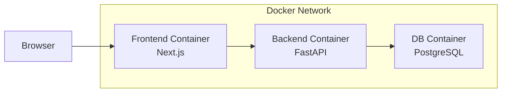
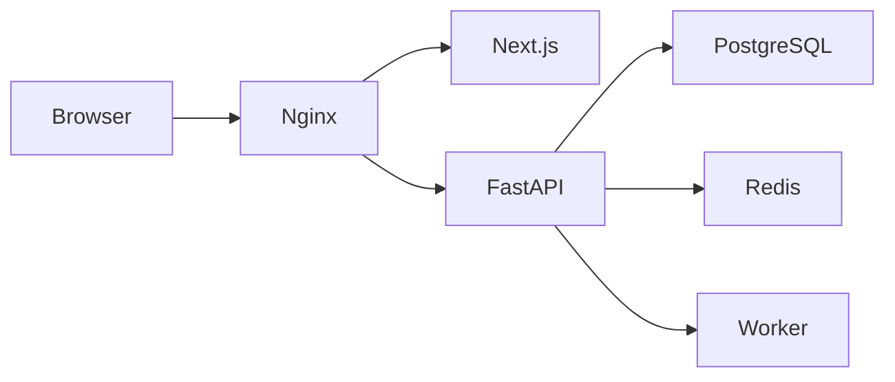

# Docker構成図・構成設計
## エンジニア向けリソース・プロジェクト管理SaaS

---

# 1. 目的

ローカル開発環境において、以下を Docker で一括起動できるようにする。

- フロントエンド（Next.js）
- バックエンド（FastAPI）
- データベース（PostgreSQL）

また、`Project / Backend / Frontend` の分離構成で、それぞれのディレクトリで個別に開発できるようにする。

---

# 2. ディレクトリ構成

```text
Project/
├─ backend/
│  ├─ app/
│  │  ├─ api/
│  │  ├─ core/
│  │  ├─ db/
│  │  ├─ models/
│  │  ├─ schemas/
│  │  ├─ services/
│  │  └─ main.py
│  ├─ requirements.txt
│  ├─ Dockerfile
│  └─ .env
│
├─ frontend/
│  ├─ app/
│  ├─ components/
│  ├─ lib/
│  ├─ public/
│  ├─ package.json
│  ├─ Dockerfile
│  └─ .env.local
│
├─ docs/
│
├─ docker-compose.yml
└─ .env
```

---

# 3. Docker構成図



---

# 4. コンテナ一覧

|サービス名|役割|ポート|
|---|---|---|
|frontend|Next.js 開発サーバー|3000|
|backend|FastAPI 開発サーバー|8000|
|db|PostgreSQL|5432|

---

# 5. docker-compose.yml 例

```yaml
version: "3.9"

services:
  frontend:
    build: ./frontend
    container_name: resourceflow_frontend
    ports:
      - "3000:3000"
    volumes:
      - ./frontend:/app
      - /app/node_modules
    environment:
      NEXT_PUBLIC_API_BASE_URL: http://localhost:8000
    depends_on:
      - backend

  backend:
    build: ./backend
    container_name: resourceflow_backend
    ports:
      - "8000:8000"
    volumes:
      - ./backend:/app
    environment:
      DATABASE_URL: postgresql://postgres:postgres@db:5432/resourceflow
      APP_ENV: local
    depends_on:
      - db

  db:
    image: postgres:15
    container_name: resourceflow_db
    restart: unless-stopped
    environment:
      POSTGRES_DB: resourceflow
      POSTGRES_USER: postgres
      POSTGRES_PASSWORD: postgres
    ports:
      - "5432:5432"
    volumes:
      - postgres_data:/var/lib/postgresql/data

volumes:
  postgres_data:
```

---

# 6. backend/Dockerfile 例

```dockerfile
FROM python:3.11-slim

WORKDIR /app

COPY requirements.txt .
RUN pip install --no-cache-dir -r requirements.txt

COPY . .

CMD ["uvicorn", "app.main:app", "--host", "0.0.0.0", "--port", "8000", "--reload"]
```

---

# 7. frontend/Dockerfile 例

```dockerfile
FROM node:20

WORKDIR /app

COPY package*.json ./
RUN npm install

COPY . .

CMD ["npm", "run", "dev"]
```

---

# 8. backend requirements.txt 例

```text
fastapi
uvicorn[standard]
sqlalchemy
psycopg2-binary
alembic
pydantic
python-dotenv
```

---

# 9. ローカル起動手順

## 9.1 初回起動

```bash
docker compose up --build
```

## 9.2 起動後のアクセス先

|対象|URL|
|---|---|
|フロントエンド|http://localhost:3000|
|バックエンドAPI|http://localhost:8000|
|Swagger UI|http://localhost:8000/docs|
|PostgreSQL|localhost:5432|

---

# 10. コンテナ間通信

Dockerネットワーク内では、サービス名で名前解決する。

## 例
- frontend → backend は `http://backend:8000`
- backend → db は `postgresql://postgres:postgres@db:5432/resourceflow`

### 注意
ブラウザから直接APIを叩くURLは `http://localhost:8000`
コンテナ内部からの接続先とは異なる

---

# 11. 環境変数方針

## backend
- `DATABASE_URL`
- `APP_ENV`
- `JWT_SECRET`
- `CORS_ALLOW_ORIGINS`

## frontend
- `NEXT_PUBLIC_API_BASE_URL`

---

# 12. 開発ルール

## backend側作業
- `backend/` 配下で FastAPI 実装
- モデル、スキーマ、API、サービスを分離

## frontend側作業
- `frontend/` 配下で Next.js 実装
- App Router 採用
- API呼び出し処理は `lib/api` などへ集約

---

# 13. 将来拡張用の追加候補

将来的には以下のサービスを追加可能。

- nginx
- redis
- worker
- mailhog
- pgadmin

構成イメージ



---

# 14. 運用イメージ

## 開発時
- `docker compose up` で全起動
- ホットリロードで開発

## 本番時
- フロントとバックを別デプロイ
- DBはマネージドPostgreSQLを想定
- Nginx / ALB などでルーティング

---

# 15. 補足

この構成により、以下が実現できる。

- フロントエンドとバックエンドの責務分離
- ローカル環境の再現性確保
- 将来のCI/CD・本番移行に耐える構造
- 各ディレクトリ単位での個別開発
